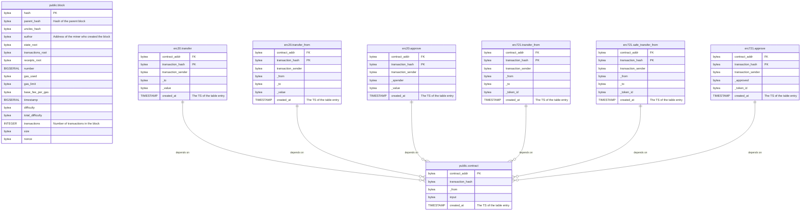

## Chainthru

- [Chainthru](#chainthru)
- [Database schema](#database-schema)
- [Crates](#crates)
- [Documentation](#documentation)
  - [Indexer](#indexer)
  - [Server](#server)

## Database schema

## Crates

## Documentation
Documentation is segregated in two:
- one part is 

### Indexer
- [Introductory & Architectural](./docs/chainthru-index.md)
- [Crate level/functionality](...)

### Server
- [Introductory & Architectural](./docs/chainthru-api.md)
- [Crate level/functionality](...)

