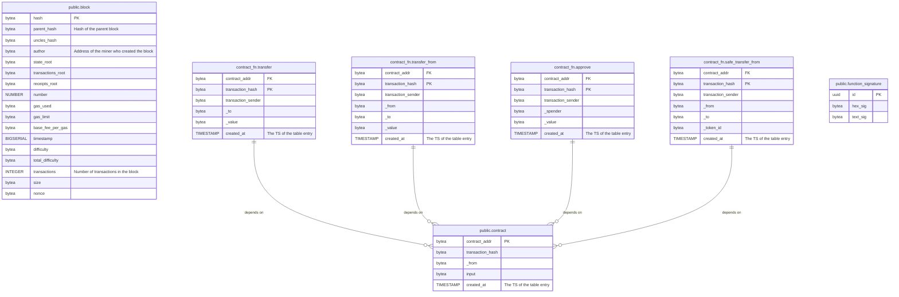

# 
chainthru

 Index Ethereum into a storage backend

    
    
    
    

> 
 🚧 work in progress 🚧

- [chainthru](#chainthru)
  - [Database schema](#database-schema)
  - [Crates](#crates)
  - [Documentation](#documentation)
    - [Index](#index)
    - [Server](#server)
    - [Primitives](#primitives)
    - [Tracing](#tracing)
    - [Core](#core)

## Database schema

## Crates
Include the following
- [chainthru (binary)](./chainthru/)
- [chainthru-index](./chainthru-index)
- [chainthru-server](./chainthru-server)
- [chainthru-primitives](./chainthru-primitives)
- [chainthru-tracing](./chainthru-tracing)

## Documentation

### Index
- [Introductory & Architectural](./docs/chainthru-index.md)
- [Crate & functionality](...)

### Server
- [Introductory & Architectural](./docs/chainthru-api.md)
- [Crate & functionality](...)

### Primitives
- [Introductory & Architectural](./docs/chainthru-primitives.md)
- [Crate & functionality](...)

### Tracing
- [Introductory & Architectural](./docs/chainthru-tracing.md)
- [Crate & functionality](...)

### Core
- [Introductory & Architectural](./docs/chainthru.md)
- [Crate & functionality](...)