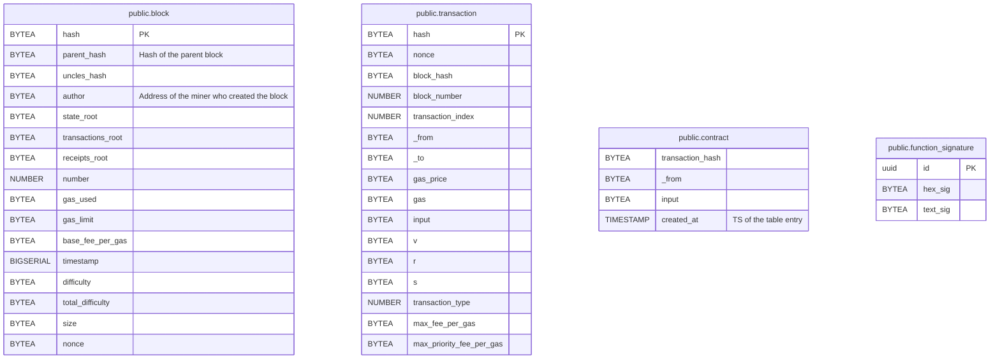

## Database
The Database is referenced by both [The indexer](../chainthru-index/), as well as the [HTTP-Server](../chainthru-server/).

Generally, there are two different ways of using `chainthru`
- with both Indexer & Server running simultaneously on different threads.
- with either `chainthru-index` or `chainthru-server` one of them running (e.g it might be desirable to decouple responsibilities in case the server receives high traffic, so as to avoid unnecessary service interruptions/slowdowns).

## Postgres - schema
